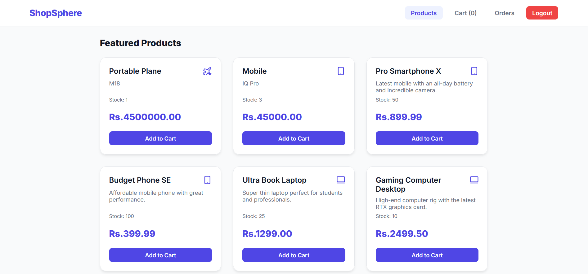
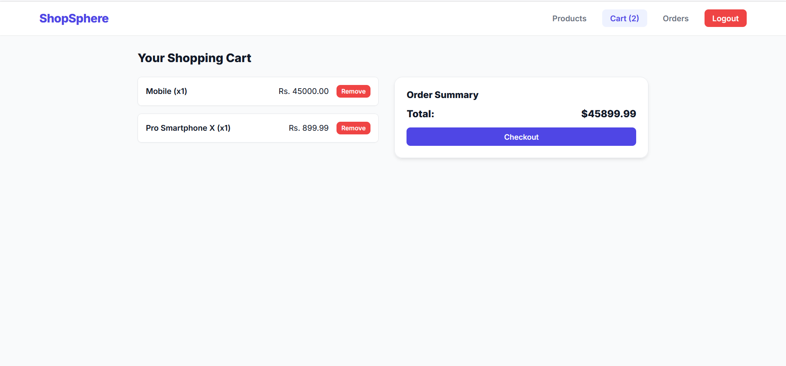
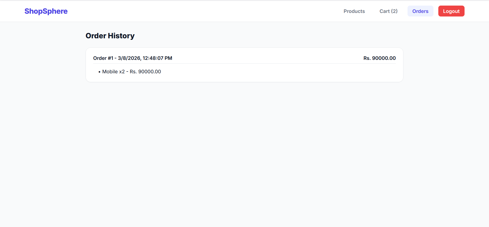
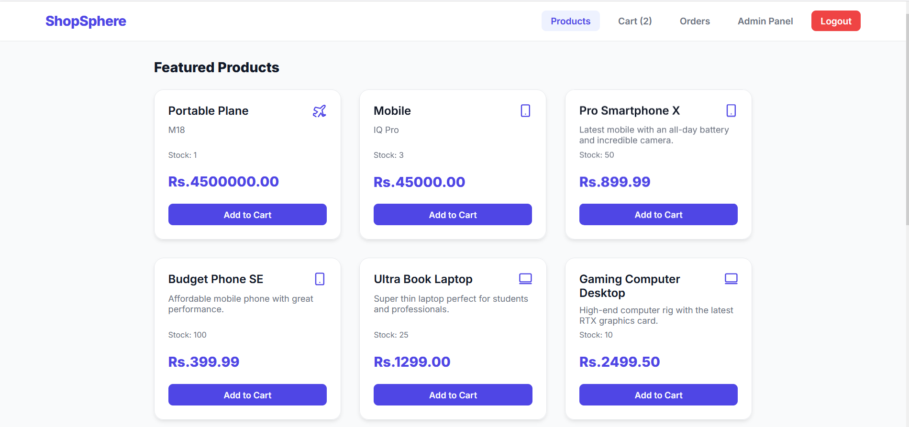
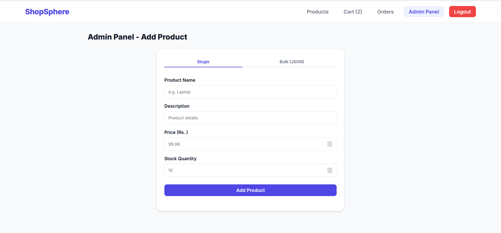
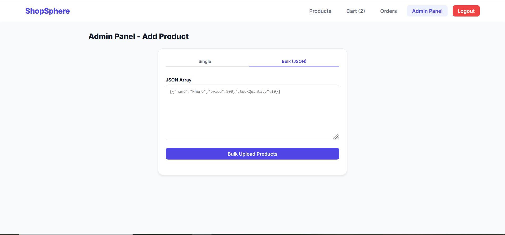

# ShopSphere Flask

ShopSphere is a full-stack e-commerce application. The backend is powered by Python and Flask, paired with a lightweight vanilla JavaScript frontend.

## 🛠️ Technology Stack

### Backend
- **Framework**: Flask 3.0.0
- **Database ORM**: Flask-SQLAlchemy 3.1.1 (SQLite)
- **Security & Authentication**: PyJWT (JSON Web Tokens), bcrypt (Password Hashing)
- **Cross-Origin Resource Sharing**: Flask-CORS

### Frontend
- **HTML5**: Semantic and accessible document structure.
- **CSS3**: Custom styling defined in `styles.css`.
- **JavaScript (Vanilla)**: Fetch API implementation for backend communication and DOM manipulation (`app.js`).

## 📁 Project Structure

```text
shopsphere-flask/
├── client/                     # Frontend Application
│   ├── index.html              # Main HTML entry point
│   ├── styles.css              # Custom styling
│   └── app.js                  # Frontend logic & API calls
├── server/                     # Backend API
│   ├── app.py                  # Application factory and configuration
│   ├── models.py               # SQLAlchemy Database Models
│   ├── requirements.txt        # Python dependencies
│   ├── utils.py                # Helper functions (e.g., JWT decorators)
│   ├── instance/               # SQLite database file (shopsphere.db)
│   └── routes/                 # API endpoint Blueprints
│       ├── auth.py
│       ├── orders.py
│       └── products.py
└── .doc/                       # Documentation and screenshots
```

## ✨ Good Practices Demonstrated

This project adheres to several industry-standard best practices:

1. **Separation of Concerns**: The backend uses Flask Blueprints (`routes/`) to intuitively group and separate endpoints by domain (Auth, Orders, Products) instead of cluttering a single file. Database models (`models.py`) and utility functions (`utils.py`) are strictly decoupled from routing logic.
2. **Security & Authentication**: Passwords strictly avoid being stored in plain text. They are hashed using `bcrypt` prior to database insertion. API endpoints are rigorously secured manually using JSON Web Tokens (`PyJWT`).
3. **Global Error Handling**: Python-level exceptions are caught globally (`@app.errorhandler(Exception)`) in `app.py` ensuring the client always receives a clean JSON response with an appropriate HTTP status code, preventing unexpected server crashes or exposing raw stack traces.
4. **API Versioning & Prefixing**: All functional routes are prefixed with `/api` (e.g., `/api/auth`, `/api/products`), which isolates the backend API explicitly and allows future versions to be appended gracefully without breaking integrations.
5. **Database ORM Integration**: Uses `SQLAlchemy` acting as a secure abstraction over database operations which natively sanitizes queries, defending against direct SQL injection vulnerabilities.

## 🚀 Setup and Installation

### Backend Setup
1. Open a terminal and navigate to the `server` directory:
   ```bash
   cd server
   ```
2. Create and activate a virtual environment (optional but recommended):
   ```bash
   python -m venv venv
   source venv/Scripts/activate  # On Windows
   # Output for MacOS/Linux: source venv/bin/activate
   ```
3. Install the required dependencies:
   ```bash
   pip install -r requirements.txt
   ```
4. Run the Flask application:
   ```bash
   python app.py
   ```
   > The backend server will be live and listening on `http://localhost:8080`.

### Frontend Setup
1. Navigate to the `client` directory.
2. You can natively double click `index.html` to open it in your browser, or alternatively serve it directly using an HTTP server:
   ```bash
   npx http-server .
   # OR
   python -m http.server 3000
   ```

## 📸 Screenshots

### User Experience
**Home Page**


**Shopping Cart**


**Order History**


### Admin Experience
**Admin Dashboard**


**Add Product**


**Bulk Add Products**

